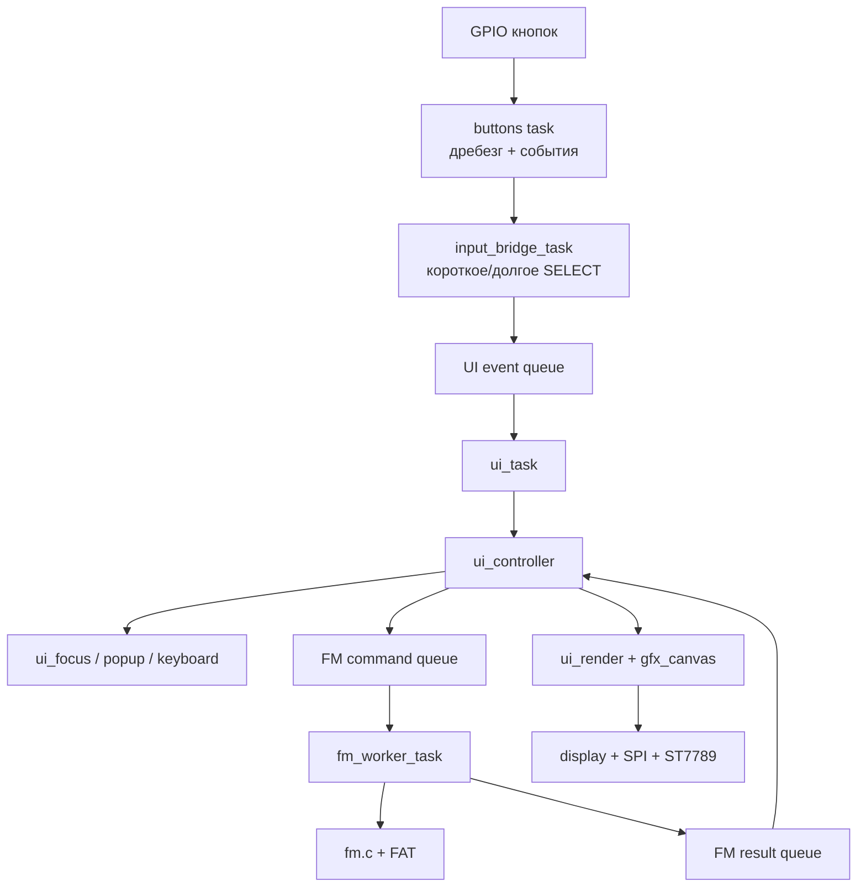

# IoTSE: контекст проекта для Codex

> Этот документ — передача проекта следующему агенту. Прочитай его целиком до изменения кода.  
> Актуальная контрольная точка описана по состоянию на 14 сентября 2026 года. Сначала сверь описание с текущим деревом репозитория и `git diff`.

## 1. Назначение устройства

**IoTSE** — собственная прошивка для портативного устройства на **ESP32-S3 N16R8**:

- 16 MB Flash;
- 8 MB Octal PSRAM;
- экран ST7789 320×170, RGB565;
- пять физических кнопок: UP, DOWN, LEFT, RIGHT, SELECT;
- внутренняя FAT-файловая система;
- в дальнейшем — Wi‑Fi, Bluetooth, IR, Sub-GHz, NRF24 и другие аппаратные функции платы.

Устройство проектируется как сильный помощник специалиста Red Team для работы на собственном оборудовании и в разрешённых средах. Долгосрочная аппаратная основа — **Bruce / Smoochiee Board V2**. Цель — собственная прошивка с более быстрым и удобным рабочим процессом, чем у типичных карманных инструментов: получить данные от периферии, просмотреть, сохранить, отредактировать, загрузить и воспроизвести в рамках разрешённого тестирования.

Будущая лицензия ещё не выбрана. Намерение автора: разрешить изучение, изменение и использование как источника вдохновения, но не разрешать продажу прошивки или производных коммерческих сборок. Не добавляй лицензию от себя: позже нужно подобрать или составить точные условия с учётом совместимости зависимостей.

## 2. Ближайшая цель

Сделать **небольшую, удобную и экономную mini-IDE на устройстве**:

1. законченный файловый менеджер;
2. надёжный FM worker, чтобы файловые операции не блокировали UI;
3. текстовый редактор с настоящим курсором по строкам и столбцам;
4. вертикальная и горизонтальная прокрутка вслед за курсором;
5. вставка текста в позицию курсора, Enter, Backspace и объединение строк;
6. понятные состояния «изменено», «сохранение», «ошибка» и безопасный выход;
7. сохранение файла без риска заменить оригинал обрезанными или частично записанными данными.

Сначала завершается этот цикл. Затем исправляется транспорт экрана/DMA и только потом подключаются реальные периферийные функции полным вертикальным срезом: **команда UI → аппаратная задача → результат → просмотр → сохранение → загрузка → повторное использование**.

## 3. Что уже работает и проверялось на плате

Пользователь сообщил, что на ESP32-S3 работают:

- вход в файловый менеджер;
- создание файлов и папок;
- запись и чтение файлов;
- переименование и удаление;
- модальная экранная клавиатура;
- контекстный popup по долгому SELECT;
- вертикальная прокрутка списка при большом количестве файлов;
- плавная прокрутка полного длинного имени выбранного файла или папки;
- длинное имя папки реально прокручивается на экране.

Текущая клавиатура пользователю нравится. Не меняй её внешний вид и управление без конкретной причины.

### Управление FM

- UP/DOWN — перемещение по списку;
- короткий SELECT — срабатывает при отпускании и открывает пункт;
- удержание SELECT примерно 700 мс — popup выбранного файла/папки;
- popup содержит Rename, Del и крестик;
- фокус popup модальный и не уходит в список;
- RIGHT выбирает крестик, LEFT закрывает popup;
- удаление требует подтверждения, начальный выбор — Cancel;
- пустое имя в Rename не означает удаление;
- длинное выделенное имя ждёт около 1 с, движется влево со скоростью около 40 px/s, ждёт около 1,2 с в конце и возвращается к началу;
- popup и клавиатура приостанавливают движение имени.

### Важная проверка реального репозитория

Последним подготовительным изменением был комплект `FM worker stage 1`. Он должен:

- удалить тестовую отправку `ENTER_VOLUME(0)` при запуске;
- добавить `fm_worker_cmd_type_t command` в `fm_worker_event_t`;
- подключить `fm_worker.h` в `ui_controller.c`;
- объявить и вызвать `ui_controller_poll_worker()`;
- пока только забирать и логировать ответы worker.

Пользователь ещё не подтвердил в этом диалоге, что именно этот последний комплект успешно собран и прошит. Поэтому **перед следующей правкой проверь фактический код и сборку**. Не предполагай, что состояние репозитория полностью совпадает с этим документом.

## 4. Слои архитектуры



Направление зависимостей должно оставаться понятным:

- драйвер кнопок не знает об экранах;
- UI не должен выполнять долгие операции с файлами или периферией;
- worker не рисует интерфейс;
- `fm.c` выполняет файловые операции и управляет моделью/кэшем;
- render только читает состояние и рисует;
- popup и клавиатура перехватывают события раньше фонового экрана;
- экран не должен напрямую управлять SPI-транзакциями.

## 5. Запуск и задачи FreeRTOS

Ожидаемый порядок `app_main()`:

1. NVS;
2. монтирование внутреннего FAT;
3. регистрация тома `Internal`;
4. `fm_worker_init()`;
5. общая SPI-шина;
6. кнопки;
7. дисплей;
8. `ui_init()`;
9. UI task;
10. input bridge task.

Из известных исходников:

| Задача | Стек | Приоритет | Назначение |
|---|---:|---:|---|
| `fm_worker` | 8192 | 3 | Файловые операции |
| `ui` | 16384 | 4 | Контроллер и отрисовка |
| `input_bridge` | 2048 | 5 | Перевод кнопок в UI events |
| `buttons` | 2048 | 5 | Опрос GPIO и подавление дребезга |

Проверь единицы размера стека для фактической версии ESP-IDF перед оптимизацией. Не уменьшай стек по ощущениям: сначала измерь high-water mark на плате.

## 6. Кнопки и поток ввода

### Физические кнопки

Текущая таблица GPIO:

| Индекс | Кнопка | GPIO |
|---:|---|---:|
| 0 | UP | 41 |
| 1 | DOWN | 40 |
| 2 | LEFT | 39 |
| 3 | RIGHT | 38 |
| 4 | SELECT | 0 |

Драйвер предполагает active-low и внутреннюю pull-up: отпущено = 1, нажато = 0.

В `buttons.c` используются параллельные массивы с одинаковым индексом кнопки:

- `s_gpio_for_button[i]` — номер GPIO;
- `raw_pressed[i]` — последнее сырое состояние;
- `stable_count[i]` — число одинаковых чтений подряд;
- `s_confirmed_pressed[i]` — подтверждённое состояние `true/false`.

Опрос примерно каждые 20 мс. После трёх одинаковых показаний формируется одно событие `BTN_EVENT_PRESSED` или `BTN_EVENT_RELEASED`. Удержание не порождает повторные pressed-события.

### Короткое и долгое SELECT

Продолжительность измеряет `input_bridge_task`, а не драйвер кнопок. Отсчёт начинается после подтверждённого `BTN_EVENT_PRESSED`:

- отпускание раньше порога → `UI_EVT_SELECT`;
- достижение примерно 700 мс → один `UI_EVT_CONTEXT`;
- отпускание после long press не должно выдавать дополнительный SELECT.

Сохраняй это свойство: иначе long press откроет popup и сразу активирует его первый пункт.

## 7. UI, фокус и модальные элементы

`ui_task` владеет обработкой UI. События проходят в `ui_controller_handle_event()`.

Приоритет маршрутизации:

1. открытый popup;
2. открытая клавиатура;
3. текущий экран;
4. обычное меню.

Пока модальный элемент открыт, событие не должно попадать нижележащему экрану.

Сейчас popup файлового менеджера специализирован. Долгосрочно popup времени, Wi‑Fi, батареи и значков потребует общей модели интерактивных объектов:

- стабильный ID объекта;
- `ui_bbox_t` для геометрии;
- короткое действие;
- долгое действие;
- доступность;
- модальная область фокуса;
- возврат фокуса к исходному объекту после закрытия.

Основа уже есть в `ui_focus_find_nearest()` и `ui_cursor_t`. Не начинай общую переделку фокуса до завершения mini-IDE, если она не нужна для текущего шага.

## 8. Файловый менеджер и его кэш

`fm.c` хранит:

- до 4 описаний томов;
- текущий выбранный том;
- `s_current_path[FM_MAX_PATH_LEN]`;
- `s_cached_entries[FM_BROWSER_MAX_ENTRIES]`;
- `s_cached_count`.

Из известных ограничений:

- `FM_MAX_NAME_LEN = 64`;
- `FM_MAX_PATH_LEN = 256`;
- `FM_BROWSER_MAX_ENTRIES = 32`;
- первые два пункта браузера синтетические: New Folder и New File;
- реальная запись `fm_get_cached_entry(0)` имеет UI-индекс 2;
- папки сортируются раньше файлов, затем используется сортировка без учёта регистра.

После create/rename/delete `fm.c` обновляет кэш. Поэтому UI должен находить переименованный или созданный объект заново по имени, а после удаления ограничивать индекс ближайшим существующим пунктом.

### Состояние прокрутки браузера

В UI различаются:

- `selected` — индекс во всём списке;
- `s_browser_top` — первый видимый индекс;
- `row` — строка на экране.

На экране помещается около восьми строк. Путь остаётся сверху, справа показывается полоса прокрутки. Длинная подпись у невыделенного объекта обрезается только при рисовании; полное имя в `fm.c` не меняется.

## 9. FM worker: текущая модель

Есть две разные очереди:

| Очередь | Отправитель | Получатель |
|---|---|---|
| `s_cmd_queue` | UI | `fm_worker_task` |
| `s_event_queue` | worker | UI |

Команда:

```c
typedef struct {
    fm_worker_cmd_type_t type;
    union {
        uint8_t volume_index;
        struct { char name[FM_WORKER_NAME_LEN]; } single_name;
        struct {
            char old_name[FM_WORKER_NAME_LEN];
            char new_name[FM_WORKER_NAME_LEN];
        } rename;
        struct {
            char name[FM_WORKER_NAME_LEN];
            bool is_dir;
        } delete_entry;
        struct { char path[256]; } file;
    } data;
} fm_worker_cmd_t;
```

`type` отвечает на вопрос «что сделать», `data` — «с какими параметрами».
`union` экономит память: одна команда использует один вариант параметров.

Известные команды:

- ENTER_VOLUME;
- ENTER_DIR;
- GO_UP;
- CREATE_FILE;
- CREATE_DIR;
- DELETE;
- RENAME;
- OPEN_FILE;
- SAVE_FILE.

`send_command()` использует `xQueueSend(s_cmd_queue, cmd, 0)`: UI не ждёт свободного места. `ESP_OK` означает только «команда скопирована в очередь», а не «операция выполнена».

`fm_worker_task()` ждёт через `xQueueReceive(..., portMAX_DELAY)`. Бесконечное ожидание допустимо здесь: блокируется специальная worker task, UI продолжает работать.

Подготовленный формат ответа:

```c
typedef struct {
    fm_worker_event_type_t type;
    esp_err_t error;
    fm_worker_cmd_type_t command;
} fm_worker_event_t;
```

`fm_worker_receive_event()` неблокирующий. Его `true` означает «сообщение получено». Полученное сообщение может содержать `FM_EVT_ERROR`.

### Что обязательно исправить при завершении worker

Сейчас архитектура worker ещё переходная:

1. UI по-прежнему может вызывать `fm_*` напрямую.
2. Worker и UI потенциально обращаются к общему пути/кэшу параллельно.
3. Успешная команда отправляет два события: `FM_EVT_OK` и `FM_EVT_CACHE_UPDATED`.
4. `OPEN_FILE` и `SAVE_FILE` в worker были заготовками без реальной работы редактора.
5. Опрос event queue перед длительным ожиданием UI queue может задержать реакцию на результат почти на секунду.
6. Очередь результатов имеет ограниченный размер; при переполнении события отбрасываются.

Рекомендуемое направление:

- одна завершённая команда → одно завершённое событие;
- событие содержит `command`, `error` и при необходимости `request_id`;
- worker сообщает UI о готовом результате через UI queue либо UI ожидает обе очереди через подходящий механизм FreeRTOS;
- UI хранит состояние `idle/pending/success/error` и не отправляет конфликтующую команду повторно;
- worker становится единственным владельцем мутаций FM;
- публикация нового кэша выполняется как согласованный snapshot: staging buffer + короткая защищённая замена либо копирование snapshot UI под mutex;
- render не держит mutex во время рисования или SPI;
- после завершения миграции запретить прямые `fm_create_*`, `fm_delete_*`, `fm_rename`, `fm_enter_*` из UI.

Не переключай сразу все операции. Переноси вертикальными шагами:

1. ENTER_VOLUME;
2. ENTER_DIR и GO_UP;
3. CREATE_FILE/CREATE_DIR;
4. RENAME;
5. DELETE;
6. загрузка/сохранение документа.

Для каждого шага проверь success, error, заполненную очередь, повторное нажатие и возврат фокуса.

## 10. Редактор: текущее и целевое состояние

Текущий переходный редактор уже использует текстовую каретку вместо общей
UI-рамки. Реализация и состояние экрана принадлежат `ui_file_editor.c`, модель
строк — `fm_text_edit.c`:

- до 100 строк;
- до 63 байт текста + `\0` в строке;
- буфер находится в PSRAM;
- строки нумеруются с нуля: `000`, `001`, ...;
- UP/DOWN двигают каретку между строками с сохранением столбца;
- DOWN на последней строке добавляет пустую строку;
- LEFT/RIGHT двигают каретку по тексту;
- SELECT открывает клавиатуру с временной копией всей текущей строки;
- поле `Text` показывает номер, изменяемую строку и каретку в реальном времени;
- `<` на клавиатуре удаляет символ слева во временной строке, OK применяет её,
  ESC отменяет все изменения этого сеанса ввода;
- долгий SELECT открывает editor popup в стиле FM: New line, Backspace, Save,
  Save & Exit;
- New line разрезает строку в позиции каретки, а Backspace в начале строки
  объединяет её с предыдущей, если результат помещается в лимит строки.

Шрифт `Px437_IBM_VGA_8x14_2x8pt7b` имеет `yAdvance = 14`, но реальный
`xAdvance = 16` пикселей. Нельзя снова рассчитывать разметку редактора через
`strlen * 8`: используй `gfx_canvas_measure_text_width()` и `xAdvance` глифа.
Верхняя шапка редактора повторяет паттерн остальных экранов: имя файла,
разделитель на `y = 18`, рабочая область ниже. Это состояние ещё должно быть
проверено пользователем на ESP32-S3.

Это всё ещё временная модель строк, а не завершённая mini-IDE.

Целевая модель редактора должна иметь один источник истины:

- документ;
- позиция курсора: строка и столбец либо абсолютный byte offset;
- вертикальное и горизонтальное окно;
- желаемый столбец при движении UP/DOWN;
- dirty flag;
- состояние загрузки/сохранения;
- ограничение размера и явное сообщение пользователю.

Для небольших файлов на ESP32-S3 разумна единая область текста в PSRAM с длиной/ёмкостью и индексом начал строк. Не вводи сложную rope-структуру без измеренной необходимости. Для вставки можно начать с `memmove`, но установить разумный максимальный размер документа.

Безопасное сохранение:

1. записать временный файл в той же директории;
2. проверить каждую запись и `fclose`;
3. при успехе заменить оригинал через rename по продуманной схеме;
4. при ошибке сохранить оригинал и документ в памяти;
5. показать ошибку пользователю.

Никогда не открывай большой/неподдерживаемый файл как пустой документ: пользователь может случайно перезаписать оригинал пустым или обрезанным содержимым.

## 11. Дисплей и известная критическая проблема DMA

**Эту проблему ещё не исправляли, но забывать о ней нельзя.**

Известная реализация `display_draw_bitmap()`:

1. вычисляет размер кадра;
2. выделяет временный `swapped` через `heap_caps_malloc(..., MALLOC_CAP_DMA)`;
3. меняет порядок байтов RGB565;
4. вызывает `esp_lcd_panel_draw_bitmap()`;
5. сразу освобождает SPI mutex;
6. сразу вызывает `free(swapped)`.

При этом `on_color_trans_done = NULL`. Передача `esp_lcd` выполняется через DMA в фоне, поэтому возврат из draw не гарантирует, что DMA перестал читать буфер. Получается use-after-free со стороны DMA. Освобождение SPI mutex до фактического завершения также не защищает всю транзакцию общей шины.

Дополнительные проблемы:

- полный экран 320×170×2 = 108800 байт;
- canvas и временный swapped одновременно требуют большие DMA-буферы;
- буфер создаётся и уничтожается на каждом кадре;
- `gfx_canvas_flush()` мог очищать dirty region даже после ошибки;
- `ui_render()` мог игнорировать результат flush.

Исправлять отдельным изолированным этапом после стабильной mini-IDE либо раньше, если проявится нестабильность дисплея. Требования к решению:

- постоянный или двойной DMA-буфер;
- передача полосами разумного размера;
- явное подтверждение завершения через `on_color_trans_done`;
- буфер не переиспользуется до callback;
- SPI mutex покрывает фактическое владение общей шиной;
- ограниченный timeout и диагностируемая ошибка;
- canvas может жить в PSRAM, DMA staging — во внутренней DMA-capable памяти;
- никаких `malloc/free` полного кадра на каждом UI frame.

Не лечить это произвольной задержкой: она не доказывает завершение DMA.

## 12. Память, разделы и конфигурация

Из известных настроек:

- Flash 16 MB;
- Octal PSRAM 8 MB, 80 MHz;
- `CONFIG_SPIRAM_USE_MALLOC=y`;
- `CONFIG_SPIRAM_TRY_ALLOCATE_PSRAM_FIRST=y`;
- внутренний резерв около 64 KB;
- heap memory protection включена;
- task watchdog включён, timeout 10 s;
- default log level в `sdkconfig.defaults` был Warning (`2`).

Таблица разделов:

| Раздел | Offset | Размер |
|---|---:|---:|
| nvs | 0x9000 | 0x6000 |
| phy_init | 0xF000 | 0x1000 |
| factory | 0x10000 | 4 MB |
| storage | 0x410000 | 10 MB |

Последняя известная прошивка была собрана на `ESP-IDF v6.1-dev-7651-gc712a0dde38`. Это development revision. Не применяй API из документации другой версии без сверки с фактическим `IDF_VER` и заголовками локального SDK.

Помни: существующий `sdkconfig` имеет приоритет над `sdkconfig.defaults`. Изменение defaults не меняет уже созданный sdkconfig автоматически.

## 13. Правила продолжения проекта

### Сохранять поведение

- Не ломай уже проверенные FM, popup, клавиатуру, прокрутку списка и длинных имён.
- Перед изменением прочитай полный путь вызовов и найди владельца состояния.
- Не делай широкий рефакторинг вместе с исправлением одного поведения.
- Не переименовывай публичные функции и файлы без необходимости.
- Не добавляй параллельную вторую реализацию рядом со старой.
- Не оставляй старый и новый `.c` в каталоге, который собирает `GLOB_RECURSE`.

### UI и конкурентность

- UI task не должна ждать файловую систему, сеть или периферию через `portMAX_DELAY`.
- `portMAX_DELAY` допустим в специальной worker task при ожидании её входной очереди.
- Модальные элементы получают события первыми.
- Render не изменяет файловую модель.
- Не выполнять выделение памяти на каждом кадре без доказанной необходимости.
- Не удерживать mutex во время полного рендера или ожидания пользователя.

### C и память

- Проверять `NULL`, коды ESP-IDF и результаты файловых операций.
- Использовать ограниченное копирование строк и всегда ставить `\0`.
- Учитывать, что имена/пути могут быть длиннее экранной подписи.
- Не хранить указатель на локальную переменную после завершения функции.
- Помнить, что FreeRTOS queue копирует элемент размера, указанного при `xQueueCreate`.
- Для объектов, читаемых DMA, соблюдать время жизни до подтверждения завершения.
- Не маскировать ошибку чтения/записи как успех.

### Порядок работы

1. Проверить `git status`, текущую ветку и фактические файлы.
2. Собрать исходную контрольную точку.
3. Сформулировать одно проверяемое изменение.
4. Внести минимальный набор согласованных файлов.
5. Запустить сборку и релевантные тесты.
6. Если доступна плата — дать короткий сценарий проверки на ней.
7. Остановиться после достижения цели шага.

Не исправляй DMA, worker, редактор и общий focus в одном коммите.

## 14. Как отчитываться пользователю

После каждого изменения обязательно сообщать:

1. **Что изменено** — поведение для пользователя.
2. **Какие файлы изменены**.
3. **Почему выбран такой вариант**.
4. **Как проверено** — сборка, host-тест, плата; не смешивать эти уровни.
5. **Что пользователь должен проверить на ESP32-S3** — точная последовательность кнопок.
6. **Что осталось рискованным или незавершённым**.

Пример нормального отчёта:

> Вход в Internal теперь отправляется через FM worker. Изменены `ui_controller.c`, `fm_worker.c/h` и модель состояния UI. Проверил сборку и тесты success/error на host-заглушках; на плате ещё не проверено. На ESP32: Settings → File Manager → Internal, затем сразу двигать фокус; UI должен оставаться живым, а браузер открыться после результата. Остальные create/delete пока идут старым путём.

Не писать «всё исправлено», если проверена только компиляция. Не выдавать host-заглушки за тест FreeRTOS на реальном устройстве.

Иногда предлагай удачные решения, если видишь упрощение архитектуры, риск потери данных или способ улучшить UX. Отделяй предложение от уже внесённого изменения и объясняй цену решения. Если предложение меняет проверенное управление, сначала покажи его пользователю.

## 15. Критерии завершения ближайших этапов

### FM worker готов

- все мутации файлов выполняет worker;
- UI не блокируется;
- одна команда имеет однозначный ответ;
- кэш публикуется без гонки с render;
- повторные нажатия во время pending обработаны;
- ошибки видны пользователю;
- popup и фокус восстанавливаются;
- проверены create/enter/up/rename/delete и переполнение очередей.

### Mini-IDE готова

- текстовый курсор перемещается по строкам и столбцам;
- длинные строки и документы прокручиваются;
- вставка, Enter и Backspace предсказуемы;
- есть dirty indicator;
- выход спрашивает о несохранённых изменениях;
- сохранение не уничтожает исправный оригинал при ошибке;
- неподдерживаемый файл не открывается как пустой;
- UI остаётся отзывчивым во время загрузки и сохранения.

### Фундамент готов к периферии

- устранён DMA use-after-free;
- измерены стеки и память;
- ошибки и watchdog дают полезную диагностику;
- есть единый шаблон command/result для аппаратных worker-задач;
- добавление новой функции не требует блокировать UI или обходить систему хранения.
