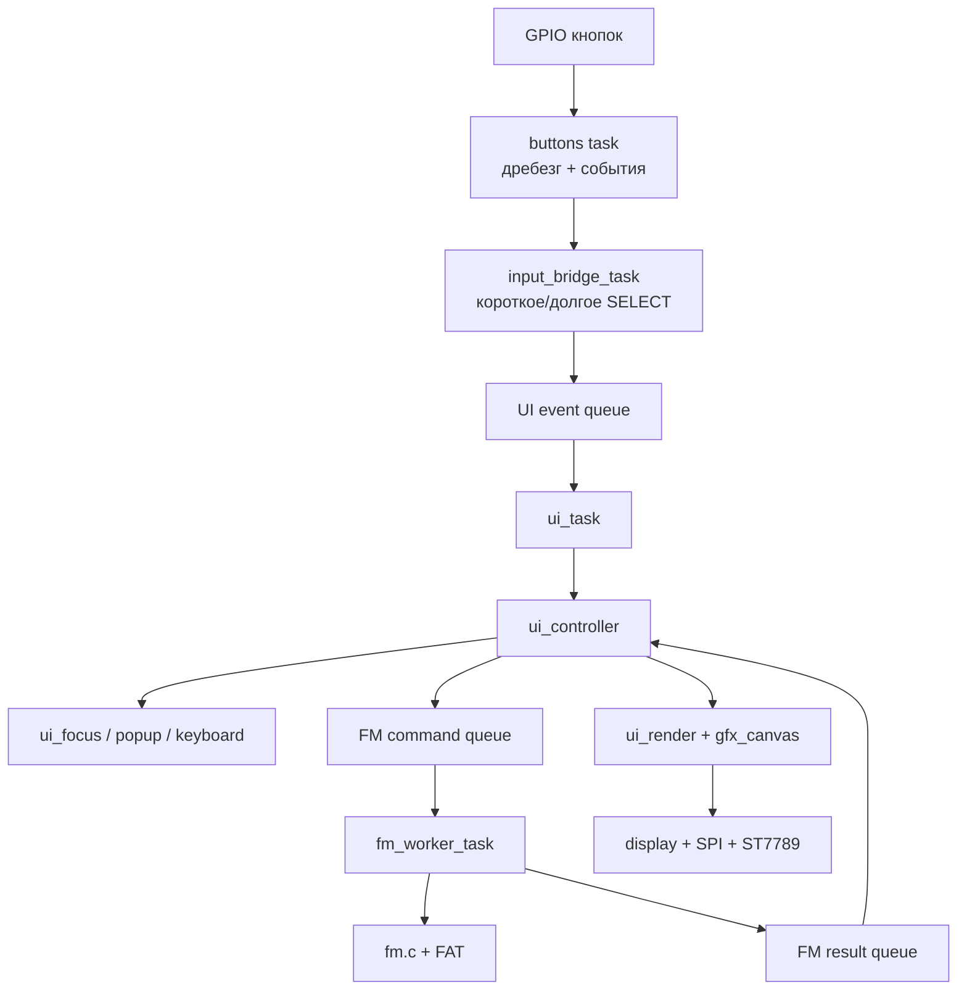

# IoTSE: контекст проекта для Codex

> Этот документ — передача проекта следующему агенту. Прочитай его целиком до изменения кода.  
> Актуальная контрольная точка описана по состоянию на 27 сентября 2026 года.
> Для продолжения в новом чате сначала прочитай документ целиком, затем особенно
> разделы 16–22: там находится фактическое состояние Wi-Fi, памяти, UI и план
> развития Embedded MAP. После этого сверь описание с деревом, `git status`,
> веткой и текущей сборкой — рабочее дерево может быть новее документа.

## 1. Назначение устройства

**IoTSE** — собственная прошивка для портативного устройства на **ESP32-S3 N16R8**:

- 16 MB Flash;
- 8 MB Octal PSRAM;
- экран ST7789 320×170, RGB565;
- пять физических кнопок: UP, DOWN, LEFT, RIGHT, SELECT;
- внутренняя FAT-файловая система;
- в дальнейшем — Wi‑Fi, IR, Sub-GHz, NRF24 и другие аппаратные функции платы.

Устройство проектируется как сильный помощник специалиста Red Team для работы на собственном оборудовании и в разрешённых средах. Долгосрочная аппаратная основа — **Bruce / Smoochiee Board V2**. Цель — собственная прошивка с более быстрым и удобным рабочим процессом, чем у типичных карманных инструментов: получить данные от периферии, просмотреть, сохранить, отредактировать, загрузить и воспроизвести в рамках разрешённого тестирования.

Будущая лицензия ещё не выбрана. Намерение автора: разрешить изучение, изменение и использование как источника вдохновения, но не разрешать продажу прошивки или производных коммерческих сборок. Не добавляй лицензию от себя: позже нужно подобрать или составить точные условия с учётом совместимости зависимостей.

## Архитектурное решение: внутреннее радио

В этой прошивке внутреннее радио ESP32-S3 полностью отдано Wi-Fi. Второй беспроводной стек исключён из исходников, UI, сборки и конфигурации, чтобы не делить память и радиовремя. Его сохранённый backend находится вне репозитория и может стать основой отдельного проекта.

## 2. Ближайшая цель

Текущий практический приоритет — **довести Wi-Fi-модуль до законченного,
устойчивого инструмента**, не ломая уже работающие FM, редактор, клавиатуру,
popup и DMA-транспорт экрана.

Ближайший вертикальный цикл:

1. превратить текущий gateway TCP scanner в понятный `Embedded MAP` с
   результатом по каждому порту;
2. добавить цель сканирования, профили и ограниченный Custom scan;
3. провести повторные проверки connect/disconnect/auto-connect после холодного
   старта и запретить конфликтующие режимы радио;
4. добавить минимальное определение сервисов с жёсткими лимитами памяти,
   сокетов и времени;
5. сохранять отчёт сканирования через FM worker, не писать файлы из Wi-Fi/UI;
6. провести длительные тесты памяти, отмены, повторного запуска и плохого эфира;

Mini-IDE и FM остаются важным фундаментом и должны проверяться на регрессии.
Общий шаблон не меняется: **команда UI → worker → snapshot/result → просмотр →
сохранение через FM → повторное открытие**.

## 3. Что уже работает и проверялось на плате

Пользователь сообщил, что на ESP32-S3 работают:

- вход в файловый менеджер;
- создание файлов и папок;
- запись и чтение файлов;
- переименование и удаление;
- модальная экранная клавиатура;
- контекстный popup по долгому SELECT;
- вертикальная прокрутка списка при большом количестве файлов;
- плавная прокрутка полного длинного имени выбранного файла или папки;
- длинное имя папки реально прокручивается на экране.

Текущая клавиатура пользователю нравится. Не меняй её внешний вид и управление без конкретной причины.

### Управление FM

- UP/DOWN — перемещение по списку;
- короткий SELECT — срабатывает при отпускании и открывает пункт;
- удержание SELECT примерно 700 мс — popup выбранного файла/папки;
- popup содержит Rename, Del и крестик;
- фокус popup модальный и не уходит в список;
- RIGHT выбирает крестик, LEFT закрывает popup;
- удаление требует подтверждения, начальный выбор — Cancel;
- пустое имя в Rename не означает удаление;
- длинное выделенное имя ждёт около 1 с, движется влево со скоростью около 40 px/s, ждёт около 1,2 с в конце и возвращается к началу;
- popup и клавиатура приостанавливают движение имени.

### Важная проверка реального репозитория

Последним подготовительным изменением был комплект `FM worker stage 1`. Он должен:

- удалить тестовую отправку `ENTER_VOLUME(0)` при запуске;
- добавить `fm_worker_cmd_type_t command` в `fm_worker_event_t`;
- подключить `fm_worker.h` в `ui_controller.c`;
- объявить и вызвать `ui_controller_poll_worker()`;
- пока только забирать и логировать ответы worker.

Пользователь ещё не подтвердил в этом диалоге, что именно этот последний комплект успешно собран и прошит. Поэтому **перед следующей правкой проверь фактический код и сборку**. Не предполагай, что состояние репозитория полностью совпадает с этим документом.

## 4. Слои архитектуры


```mermaid
flowchart TD
    GPIO["GPIO кнопок"] --> Buttons["buttons task\nдребезг + события"]
    Buttons --> Bridge["input_bridge_task\nкороткое/долгое SELECT"]
    Bridge --> UIQueue["UI event queue"]
    UIQueue --> UITask["ui_task"]
    UITask --> Controller["ui_controller"]
    Controller --> Focus["ui_focus / popup / keyboard"]
    Controller --> CmdQueue["FM command queue"]
    CmdQueue --> Worker["fm_worker_task"]
    Worker --> FM["fm.c + FAT"]
    Worker --> ResultQueue["FM result queue"]
    ResultQueue --> Controller
    Controller --> Render["ui_render + gfx_canvas"]
    Render --> Display["display + SPI + ST7789"]
```

Направление зависимостей должно оставаться понятным:

- драйвер кнопок не знает об экранах;
- UI не должен выполнять долгие операции с файлами или периферией;
- worker не рисует интерфейс;
- `fm.c` выполняет файловые операции и управляет моделью/кэшем;
- render только читает состояние и рисует;
- popup и клавиатура перехватывают события раньше фонового экрана;
- экран не должен напрямую управлять SPI-транзакциями.

## 5. Запуск и задачи FreeRTOS

Ожидаемый порядок `app_main()`:

1. NVS;
2. монтирование внутреннего FAT;
3. регистрация тома `Internal`;
4. `fm_worker_init()`;
5. `wifi_worker_init()` с выключенным radio;
6. `wifi_port_scan_init()`; отказ scanner здесь fail-soft;
7. общая SPI-шина;
8. кнопки;
9. дисплей и постоянные DMA-полосы;
10. `ui_init()`;
11. UI task;
12. input bridge task.

Из известных исходников:

| Задача | Стек | Приоритет | Назначение |
|---|---:|---:|---|
| `fm_worker` | 8192 | 3 | Файловые операции |
| `wifi_worker` | 4096 | 3 | Lifecycle и команды Wi-Fi-радио |
| `wifi_port_scan` | 4096 | 2 | Persistent TCP scanner |
| `wifi_pcap` | 4096 | 2 | Асинхронная запись PCAP; создаётся лениво |
| `ui` | 16384 | 4 | Контроллер и отрисовка |
| `input_bridge` | 2048 | 5 | Перевод кнопок в UI events |
| `buttons` | 2048 | 5 | Опрос GPIO и подавление дребезга |

Проверь единицы размера стека для фактической версии ESP-IDF перед оптимизацией. Не уменьшай стек по ощущениям: сначала измерь high-water mark на плате.

## 6. Кнопки и поток ввода

### Физические кнопки

Текущая таблица GPIO:

| Индекс | Кнопка | GPIO |
|---:|---|---:|
| 0 | UP | 41 |
| 1 | DOWN | 40 |
| 2 | LEFT | 39 |
| 3 | RIGHT | 38 |
| 4 | SELECT | 0 |

Драйвер предполагает active-low и внутреннюю pull-up: отпущено = 1, нажато = 0.

В `buttons.c` используются параллельные массивы с одинаковым индексом кнопки:

- `s_gpio_for_button[i]` — номер GPIO;
- `raw_pressed[i]` — последнее сырое состояние;
- `stable_count[i]` — число одинаковых чтений подряд;
- `s_confirmed_pressed[i]` — подтверждённое состояние `true/false`.

Опрос примерно каждые 20 мс. После трёх одинаковых показаний формируется одно событие `BTN_EVENT_PRESSED` или `BTN_EVENT_RELEASED`. Удержание не порождает повторные pressed-события.

### Короткое и долгое SELECT

Продолжительность измеряет `input_bridge_task`, а не драйвер кнопок. Отсчёт начинается после подтверждённого `BTN_EVENT_PRESSED`:

- отпускание раньше порога → `UI_EVT_SELECT`;
- достижение примерно 700 мс → один `UI_EVT_CONTEXT`;
- отпускание после long press не должно выдавать дополнительный SELECT.

Сохраняй это свойство: иначе long press откроет popup и сразу активирует его первый пункт.

## 7. UI, фокус и модальные элементы

`ui_task` владеет обработкой UI. События проходят в `ui_controller_handle_event()`.

Приоритет маршрутизации:

1. открытый popup;
2. открытая клавиатура;
3. текущий экран;
4. обычное меню.

Пока модальный элемент открыт, событие не должно попадать нижележащему экрану.

Сейчас popup файлового менеджера специализирован. Долгосрочно popup времени, Wi‑Fi, батареи и значков потребует общей модели интерактивных объектов:

- стабильный ID объекта;
- `ui_bbox_t` для геометрии;
- короткое действие;
- долгое действие;
- доступность;
- модальная область фокуса;
- возврат фокуса к исходному объекту после закрытия.

Основа уже есть в `ui_focus_find_nearest()` и `ui_cursor_t`. Не начинай общую переделку фокуса до завершения mini-IDE, если она не нужна для текущего шага.

## 8. Файловый менеджер и его кэш

`fm.c` хранит:

- до 4 описаний томов;
- текущий выбранный том;
- `s_current_path[FM_MAX_PATH_LEN]`;
- `s_cached_entries[FM_BROWSER_MAX_ENTRIES]`;
- `s_cached_count`.

Из известных ограничений:

- `FM_MAX_NAME_LEN = 64`;
- `FM_MAX_PATH_LEN = 256`;
- `FM_BROWSER_MAX_ENTRIES = 32`;
- первые два пункта браузера синтетические: New Folder и New File;
- реальная запись `fm_get_cached_entry(0)` имеет UI-индекс 2;
- папки сортируются раньше файлов, затем используется сортировка без учёта регистра.

После create/rename/delete `fm.c` обновляет кэш. Поэтому UI должен находить переименованный или созданный объект заново по имени, а после удаления ограничивать индекс ближайшим существующим пунктом.

### Состояние прокрутки браузера

В UI различаются:

- `selected` — индекс во всём списке;
- `s_browser_top` — первый видимый индекс;
- `row` — строка на экране.

На экране помещается около восьми строк. Путь остаётся сверху, справа показывается полоса прокрутки. Длинная подпись у невыделенного объекта обрезается только при рисовании; полное имя в `fm.c` не меняется.

## 9. FM worker: текущая модель

Есть две разные очереди:

| Очередь | Отправитель | Получатель |
|---|---|---|
| `s_cmd_queue` | UI | `fm_worker_task` |
| `s_event_queue` | worker | UI |

Команда:

```c
typedef struct {
    fm_worker_cmd_type_t type;
    union {
        uint8_t volume_index;
        struct { char name[FM_WORKER_NAME_LEN]; } single_name;
        struct {
            char old_name[FM_WORKER_NAME_LEN];
            char new_name[FM_WORKER_NAME_LEN];
        } rename;
        struct {
            char name[FM_WORKER_NAME_LEN];
            bool is_dir;
        } delete_entry;
        struct { char path[256]; } file;
    } data;
} fm_worker_cmd_t;
```

`type` отвечает на вопрос «что сделать», `data` — «с какими параметрами».
`union` экономит память: одна команда использует один вариант параметров.

Известные команды:

- ENTER_VOLUME;
- ENTER_DIR;
- GO_UP;
- CREATE_FILE;
- CREATE_DIR;
- DELETE;
- RENAME;
- OPEN_FILE;
- SAVE_FILE.

`send_command()` использует `xQueueSend(s_cmd_queue, cmd, 0)`: UI не ждёт свободного места. `ESP_OK` означает только «команда скопирована в очередь», а не «операция выполнена».

`fm_worker_task()` ждёт через `xQueueReceive(..., portMAX_DELAY)`. Бесконечное ожидание допустимо здесь: блокируется специальная worker task, UI продолжает работать.

Подготовленный формат ответа:

```c
typedef struct {
    fm_worker_event_type_t type;
    esp_err_t error;
    fm_worker_cmd_type_t command;
} fm_worker_event_t;
```

`fm_worker_receive_event()` неблокирующий. Его `true` означает «сообщение получено». Полученное сообщение может содержать `FM_EVT_ERROR`.

### Что обязательно исправить при завершении worker

Сейчас архитектура worker ещё переходная:

1. UI по-прежнему может вызывать `fm_*` напрямую.
2. Worker и UI потенциально обращаются к общему пути/кэшу параллельно.
3. Успешная команда отправляет два события: `FM_EVT_OK` и `FM_EVT_CACHE_UPDATED`.
4. `OPEN_FILE` и `SAVE_FILE` в worker были заготовками без реальной работы редактора.
5. Опрос event queue перед длительным ожиданием UI queue может задержать реакцию на результат почти на секунду.
6. Очередь результатов имеет ограниченный размер; при переполнении события отбрасываются.

Рекомендуемое направление:

- одна завершённая команда → одно завершённое событие;
- событие содержит `command`, `error` и при необходимости `request_id`;
- worker сообщает UI о готовом результате через UI queue либо UI ожидает обе очереди через подходящий механизм FreeRTOS;
- UI хранит состояние `idle/pending/success/error` и не отправляет конфликтующую команду повторно;
- worker становится единственным владельцем мутаций FM;
- публикация нового кэша выполняется как согласованный snapshot: staging buffer + короткая защищённая замена либо копирование snapshot UI под mutex;
- render не держит mutex во время рисования или SPI;
- после завершения миграции запретить прямые `fm_create_*`, `fm_delete_*`, `fm_rename`, `fm_enter_*` из UI.

Не переключай сразу все операции. Переноси вертикальными шагами:

1. ENTER_VOLUME;
2. ENTER_DIR и GO_UP;
3. CREATE_FILE/CREATE_DIR;
4. RENAME;
5. DELETE;
6. загрузка/сохранение документа.

Для каждого шага проверь success, error, заполненную очередь, повторное нажатие и возврат фокуса.

## 10. Редактор: текущее и целевое состояние

Текущий переходный редактор уже использует текстовую каретку вместо общей
UI-рамки. Реализация и состояние экрана принадлежат `ui_file_editor.c`, модель
строк — `fm_text_edit.c`:

- до 100 строк;
- до 63 байт текста + `\0` в строке;
- буфер находится в PSRAM;
- строки нумеруются с нуля: `000`, `001`, ...;
- UP/DOWN двигают каретку между строками с сохранением столбца;
- DOWN на последней строке добавляет пустую строку;
- LEFT/RIGHT двигают каретку по тексту;
- SELECT открывает клавиатуру с временной копией всей текущей строки;
- поле `Text` показывает номер, изменяемую строку и каретку в реальном времени;
- `<` на клавиатуре удаляет символ слева во временной строке, OK применяет её,
  ESC отменяет все изменения этого сеанса ввода;
- долгий SELECT открывает editor popup в стиле FM: New line, Backspace, Save,
  Save & Exit;
- New line разрезает строку в позиции каретки, а Backspace в начале строки
  объединяет её с предыдущей, если результат помещается в лимит строки.

Шрифт `Px437_IBM_VGA_8x14_2x8pt7b` имеет `yAdvance = 14`, но реальный
`xAdvance = 16` пикселей. Нельзя снова рассчитывать разметку редактора через
`strlen * 8`: используй `gfx_canvas_measure_text_width()` и `xAdvance` глифа.
Верхняя шапка редактора повторяет паттерн остальных экранов: имя файла,
разделитель на `y = 18`, рабочая область ниже. Это состояние ещё должно быть
проверено пользователем на ESP32-S3.

Это всё ещё временная модель строк, а не завершённая mini-IDE.

Целевая модель редактора должна иметь один источник истины:

- документ;
- позиция курсора: строка и столбец либо абсолютный byte offset;
- вертикальное и горизонтальное окно;
- желаемый столбец при движении UP/DOWN;
- dirty flag;
- состояние загрузки/сохранения;
- ограничение размера и явное сообщение пользователю.

Для небольших файлов на ESP32-S3 разумна единая область текста в PSRAM с длиной/ёмкостью и индексом начал строк. Не вводи сложную rope-структуру без измеренной необходимости. Для вставки можно начать с `memmove`, но установить разумный максимальный размер документа.

Безопасное сохранение:

1. записать временный файл в той же директории;
2. проверить каждую запись и `fclose`;
3. при успехе заменить оригинал через rename по продуманной схеме;
4. при ошибке сохранить оригинал и документ в памяти;
5. показать ошибку пользователю.

Никогда не открывай большой/неподдерживаемый файл как пустой документ: пользователь может случайно перезаписать оригинал пустым или обрезанным содержимым.

## 11. Дисплей и исправленный DMA-транспорт

DMA use-after-free устранён. Исправление собрано, прошито и проверялось на
ESP32-S3 совместно с Wi-Fi:

- canvas 320×170 перенесён из внутренней DMA-памяти в PSRAM;
- display владеет двумя постоянными DMA-полосами по 320×10 RGB565 (по 6400
  байт каждая);
- пока DMA отправляет одну полосу, CPU выполняет byte-swap следующей;
- `on_color_trans_done` выдаёт completion token, и полоса не переиспользуется
  до подтверждения;
- общий SPI mutex удерживается до завершения всех DMA-транзакций кадра;
- dirty rectangle отправляется прямо из canvas с шагом строки, без временного
  полноразмерного scratch;
- dirty state очищается только после успешного flush;
- при DMA timeout транспорт переходит в fail-safe quarantine и не отдаёт SPI
  другим устройствам при неизвестном состоянии транзакции.

На плате подтверждалась строка `DMA ping-pong allocated: 2 x 6400 bytes`, а
ошибка `swap buffer alloc failed (108800 bytes)` после перехода на полосы не
возвращалась. Длительный soak test одновременной работы UI/Wi-Fi всё ещё нужен.

Историческая сломанная реализация `display_draw_bitmap()`, которую нельзя
возвращать, работала так:

1. вычисляет размер кадра;
2. выделяет временный `swapped` через `heap_caps_malloc(..., MALLOC_CAP_DMA)`;
3. меняет порядок байтов RGB565;
4. вызывает `esp_lcd_panel_draw_bitmap()`;
5. сразу освобождает SPI mutex;
6. сразу вызывает `free(swapped)`.

При этом `on_color_trans_done = NULL`. Передача `esp_lcd` выполняется через DMA в фоне, поэтому возврат из draw не гарантирует, что DMA перестал читать буфер. Получается use-after-free со стороны DMA. Освобождение SPI mutex до фактического завершения также не защищает всю транзакцию общей шины.

Дополнительные проблемы:

- полный экран 320×170×2 = 108800 байт;
- canvas и временный swapped одновременно требуют большие DMA-буферы;
- буфер создаётся и уничтожается на каждом кадре;
- `gfx_canvas_flush()` мог очищать dirty region даже после ошибки;
- `ui_render()` мог игнорировать результат flush.

Эти требования уже реализованы и должны сохраняться при дальнейших изменениях:

- постоянный или двойной DMA-буфер;
- передача полосами разумного размера;
- явное подтверждение завершения через `on_color_trans_done`;
- буфер не переиспользуется до callback;
- SPI mutex покрывает фактическое владение общей шиной;
- ограниченный timeout и диагностируемая ошибка;
- canvas может жить в PSRAM, DMA staging — во внутренней DMA-capable памяти;
- никаких `malloc/free` полного кадра на каждом UI frame.

Не лечить это произвольной задержкой: она не доказывает завершение DMA.

## 12. Память, разделы и конфигурация

Из известных настроек:

- Flash 16 MB;
- Octal PSRAM 8 MB, 80 MHz;
- `CONFIG_SPIRAM_USE_MALLOC=y`;
- `CONFIG_SPIRAM_TRY_ALLOCATE_PSRAM_FIRST=y`;
- внутренний резерв около 64 KB;
- heap memory protection включена;
- task watchdog включён, timeout 10 s;
- default log level в `sdkconfig.defaults` был Warning (`2`).

Таблица разделов:

| Раздел | Offset | Размер |
|---|---:|---:|
| nvs | 0x9000 | 0x6000 |
| phy_init | 0xF000 | 0x1000 |
| factory | 0x10000 | 4 MB |
| storage | 0x410000 | 10 MB |

Последняя известная прошивка была собрана на `ESP-IDF v6.1-dev-7651-gc712a0dde38`. Это development revision. Не применяй API из документации другой версии без сверки с фактическим `IDF_VER` и заголовками локального SDK.

Помни: существующий `sdkconfig` имеет приоритет над `sdkconfig.defaults`. Изменение defaults не меняет уже созданный sdkconfig автоматически.

## 13. Правила продолжения проекта

### Сохранять поведение

- Не ломай уже проверенные FM, popup, клавиатуру, прокрутку списка и длинных имён.
- Перед изменением прочитай полный путь вызовов и найди владельца состояния.
- Не делай широкий рефакторинг вместе с исправлением одного поведения.
- Не переименовывай публичные функции и файлы без необходимости.
- Не добавляй параллельную вторую реализацию рядом со старой.
- Не оставляй старый и новый `.c` в каталоге, который собирает `GLOB_RECURSE`.

### UI и конкурентность

- UI task не должна ждать файловую систему, сеть или периферию через `portMAX_DELAY`.
- `portMAX_DELAY` допустим в специальной worker task при ожидании её входной очереди.
- Модальные элементы получают события первыми.
- Render не изменяет файловую модель.
- Не выполнять выделение памяти на каждом кадре без доказанной необходимости.
- Не удерживать mutex во время полного рендера или ожидания пользователя.

### C и память

- Проверять `NULL`, коды ESP-IDF и результаты файловых операций.
- Использовать ограниченное копирование строк и всегда ставить `\0`.
- Учитывать, что имена/пути могут быть длиннее экранной подписи.
- Не хранить указатель на локальную переменную после завершения функции.
- Помнить, что FreeRTOS queue копирует элемент размера, указанного при `xQueueCreate`.
- Для объектов, читаемых DMA, соблюдать время жизни до подтверждения завершения.
- Не маскировать ошибку чтения/записи как успех.

### Порядок работы

1. Проверить `git status`, текущую ветку и фактические файлы.
2. Собрать исходную контрольную точку.
3. Сформулировать одно проверяемое изменение.
4. Внести минимальный набор согласованных файлов.
5. Запустить сборку и релевантные тесты.
6. Если доступна плата — дать короткий сценарий проверки на ней.
7. Остановиться после достижения цели шага.

Не исправляй DMA, worker, редактор и общий focus в одном коммите.

## 14. Как отчитываться пользователю

После каждого изменения обязательно сообщать:

1. **Что изменено** — поведение для пользователя.
2. **Какие файлы изменены**.
3. **Почему выбран такой вариант**.
4. **Как проверено** — сборка, host-тест, плата; не смешивать эти уровни.
5. **Что пользователь должен проверить на ESP32-S3** — точная последовательность кнопок.
6. **Что осталось рискованным или незавершённым**.

Пример нормального отчёта:

> Вход в Internal теперь отправляется через FM worker. Изменены `ui_controller.c`, `fm_worker.c/h` и модель состояния UI. Проверил сборку и тесты success/error на host-заглушках; на плате ещё не проверено. На ESP32: Settings → File Manager → Internal, затем сразу двигать фокус; UI должен оставаться живым, а браузер открыться после результата. Остальные create/delete пока идут старым путём.

Не писать «всё исправлено», если проверена только компиляция. Не выдавать host-заглушки за тест FreeRTOS на реальном устройстве.

Иногда предлагай удачные решения, если видишь упрощение архитектуры, риск потери данных или способ улучшить UX. Отделяй предложение от уже внесённого изменения и объясняй цену решения. Если предложение меняет проверенное управление, сначала покажи его пользователю.

## 15. Критерии завершения ближайших этапов

### FM worker готов

- все мутации файлов выполняет worker;
- UI не блокируется;
- одна команда имеет однозначный ответ;
- кэш публикуется без гонки с render;
- повторные нажатия во время pending обработаны;
- ошибки видны пользователю;
- popup и фокус восстанавливаются;
- проверены create/enter/up/rename/delete и переполнение очередей.

### Mini-IDE готова

- текстовый курсор перемещается по строкам и столбцам;
- длинные строки и документы прокручиваются;
- вставка, Enter и Backspace предсказуемы;
- есть dirty indicator;
- выход спрашивает о несохранённых изменениях;
- сохранение не уничтожает исправный оригинал при ошибке;
- неподдерживаемый файл не открывается как пустой;
- UI остаётся отзывчивым во время загрузки и сохранения.

### Фундамент готов к периферии

- устранён DMA use-after-free;
- измерены стеки и память;
- ошибки и watchdog дают полезную диагностику;
- есть единый шаблон command/result для аппаратных worker-задач;
- добавление новой функции не требует блокировать UI или обходить систему хранения.

## 16. Фактическая контрольная точка на 27 сентября 2026 года

Этот раздел важнее старых планов выше, если они расходятся с текущим кодом.
Перед изменением всё равно выполни `git status`, `git branch --show-current`,
`git diff` и исходную сборку: в рабочем дереве находится большой Wi-Fi/UI этап,
и нельзя удалять его как «лишние незакоммиченные файлы».

Последняя подтверждённая сборка и прошивка:

- целевая плата: ESP32-S3 N16R8;
- ESP-IDF: локальная development-ветка v6.x;
- приложение собрано успешно;
- `IoTSE.bin`: 1 030 672 байта (`0xFBA10`);
- SHA-256 прошитого бинарника:
  `2F64FB4FCCF8DEA0CB2322A4B4EB304DFBB91A707EC9B9B38EDE822F73147351`;
- JTAG записал приложение и закончил строкой `Verify OK`;
- после reset устройство загрузилось, пользователь открыл `Embedded MAP` и
  получил результат Quick scan `F:12`, то есть новый экран и scanner worker
  фактически исполняются на плате.

Временные сообщения OpenOCD `Timed out waiting for CPU to be halted` и
`Memory protection fault` появлялись во время reset, но OpenOCD затем повторно
остановил ядро, перепрошил image и выполнил успешную проверку. Оценивать итог
нужно по финальным `Programming Finished` и `Verify OK`, а не по одиночному
reset warning.

Что уже реально появилось в проекте:

- безопасный display DMA ping-pong вместо полноэкранного временного DMA-буфера;
- canvas в PSRAM и dirty-rectangle flush;
- ускоренный SPI дисплея 40 MHz;
- rounded UI: popup, клавиатура, общий курсор и action-контуры;
- Wi-Fi Worker и низкоуровневый адаптер ESP-IDF;
- сканирование AP с SSID, RSSI, security, BSSID и каналом;
- подключение к AP, сохранённые credentials, auto-connect и Forget;
- интерактивный индикатор-планета с IP/mask/gateway/MAC/BSSID/RSSI;
- promiscuous Air Monitor, channel/hopper, статистика и график пакетов;
- ограниченный захват пакетов, сохранение PCAP и HTTP export;
- отдельный persistent TCP port scanner;
- отдельная страница `Embedded MAP`, куда сканер перенесён из popup сети.

Что нельзя считать полностью завершённым без повторного теста:

- холодный старт и auto-connect после нескольких последовательных reboot;
- длительное подключение к AP на несколько часов;
- 50–100 циклов входа/выхода из Air Monitor;
- сохранение нескольких PCAP подряд и переполнение capture store;
- работа HTTP export после смены сети;
- отмена port scan на каждом возможном шаге;
- отсутствие утечек heap и уменьшения task high-water mark после soak test;
- подробная классификация каждого TCP-порта, а не только итоговые счётчики.

## 17. Актуальный UI и визуальные правила

### Основное Wi-Fi меню

Текущие пункты `Wi-Fi`:

1. `Networks` — поиск точек доступа и подключение;
2. `Air Monitor` — пассивный мониторинг Wi-Fi-кадров;
3. `Embedded MAP` — TCP scanner подключённой лабораторной сети;
4. `Export PCAP` — передача сохранённого захвата через HTTP;
5. `< BACK`.

### Общий курсор

Обычный UI-курсор больше не является тяжёлым залитым прямоугольником. Он
рисуется как четыре раздельных скруглённых угловых контура и плавно движется к
целевому `bbox`. На новый экран нельзя добавлять второй самостоятельный курсор,
если можно использовать общий `ui_cursor_t`: иначе при переходе к планете или
между строками появляются дубли.

Текстовая каретка редактора `|` — отдельный объект и не должна переводиться на
общую рамку. Её мигание обновляется dirty rectangle без полного кадра.

### Popup

Текущий стиль popup необходимо сохранять:

- чёрная скруглённая панель с тонким контуром;
- фон под модальным окном затемняется через `gfx_canvas_dim()` примерно до 50%;
- действия — скруглённые контуры без тяжёлой сплошной заливки;
- крестик рисуется двумя тонкими линиями, а не жирным символом шрифта;
- текст каждого action клипуется внутри его прямоугольника;
- слишком длинный выбранный action ждёт 1000 мс, движется примерно 40 px/s,
  ждёт 1200 мс в конце и повторяет цикл;
- popup всегда получает событие раньше фонового экрана;
- после закрытия popup событие не должно дополнительно активировать строку под
  ним.

Popup выбранной Wi-Fi-сети теперь содержит только:

- `[x] Auto` / `[ ] Auto`;
- `Forget network` с отдельным подтверждением;
- `Web UI (soon)`.

Port scan из этого popup удалён намеренно. Не возвращай Quick/Common туда:
весь scanner UI должен развиваться внутри `Embedded MAP`.

### Клавиатура

Клавиатура общая для FM/editor/Wi-Fi. Клавиши — скруглённые контуры вокруг
символов. Переключатель раскладки циклически меняет:

1. строчные буквы;
2. заглавные буквы;
3. специальные символы.

Это нужно для реальных Wi-Fi-паролей. Сохраняй Backspace, OK, ESC, текущие
границы строки и отсутствие изменения исходного текста при ESC.

### Networks

Экран сетей:

- сортирует AP от сильного RSSI к слабому;
- показывает RSSI числом в dBm, а не полосками;
- good/fair/weak окрашиваются зелёным/жёлтым/красным;
- длинный выбранный SSID прокручивается с паузами;
- список обновляется примерно раз в 5 секунд;
- выбранный AP сохраняется по BSSID во время refresh;
- SELECT подключается или открывает клавиатуру;
- long SELECT открывает popup настроек сети.

Автоматическое обновление списка не стартует, пока выполняется port scan.

### Планета подключения

При активном STA-соединении почти на всех экранах показывается небольшая
планета в правой части status/header area. RIGHT может передать ей общий курсор,
SELECT открывает панель с SSID, IP, mask, gateway, STA MAC, BSSID и RSSI.
Длинные значения прокручиваются. В панели есть `Disconnect`.

Планета специально скрыта в FM/editor и `Air Monitor`. В Air Monitor STA и
auto-connect не должны самопроизвольно занимать радио.

## 18. Актуальная архитектура Wi-Fi

Главный поток данных:

```text
UI event
  -> ui_wifi_connect / ui_wifi_monitor / ui_wifi_map / ui_wifi_export
  -> неблокирующая команда
  -> WiFi Worker или Port Scan Worker
  -> ESP-IDF/lwIP
  -> result/snapshot/progress
  -> UI draw
  -> при сохранении отдельный writer/FM путь
```

### Владение слоями

- `src/wifi/wifi.c` и `wifi.h` — тонкий backend над `esp_wifi_*`, netif и
  event loop. Вызывать радиооперации напрямую из UI нельзя.
- `wifi_worker.c/h` — единственный владелец lifecycle основного Wi-Fi-радио,
  mode transitions, command/result и auto-connect.
- `wifi_credentials.c/h` — versioned NVS record для одной последней успешной
  сети. Пароль не возвращается UI и не печатается в лог.
- `wifi_promiscuous.c/h` — короткий callback ESP-IDF и очередь сырых кадров.
- `wifi_frame_parser.c/h` — разбор метаданных за пределами callback.
- `wifi_channel_hopper.c/h` — bounded channel hopping.
- `wifi_capture_store.c/h` — PSRAM capture store и отдельная writer task PCAP.
- `wifi_capture_export.c/h` — HTTP export уже сохранённого/подготовленного PCAP.
- `wifi_port_scan.c/h` — отдельная persistent task TCP scanner; она не должна
  сливаться с UI и не должна создавать/удалять task при каждом запуске.
- `wifi_ieee80211_codec.c/h` — только offline serializer/validator кадров для
  тестов/PCAP. Это не готовый raw injection engine и не надо выдавать его за
  передачу кадров в эфир.

### WiFi Worker

Фактические состояния:

```text
OFF, STARTING, IDLE, SCANNING, CONNECTING, DISCONNECTING,
SWITCHING_NETWORK, CONNECTED, PROMISCUOUS, STOPPING, ERROR
```

Поддерживаются команды START, SCAN, CONNECT, DISCONNECT,
ENABLE/DISABLE_PROMISCUOUS, STOP, HOPPER_START/STOP, SET_CHANNEL,
SET_AUTO_CONNECT и FORGET_NETWORK.

Правила:

- внешняя command queue имеет глубину 1;
- result mailbox имеет глубину 1;
- внутренняя radio-event queue имеет глубину 4;
- `ESP_OK` от функции `wifi_worker_send_*` означает только копирование команды
  в очередь, а не успех радиооперации;
- терминальный результат содержит `request_id`;
- callback драйвера не рисует, не пишет FAT, не логирует payload и не выделяет
  память;
- scan snapshot и connection snapshot публикуются под коротким mutex;
- UI копирует snapshot и рисует уже свою стабильную копию;
- auto-connect приостанавливается перед Air Monitor и возобновляется только
  через worker;
- ручное подключение имеет приоритет над фоновым retry.

Credentials сохраняются только после успешного соединения. NVS record имеет
magic, version, длины, flags, SSID и password; после записи выполняется чтение и
сравнение. Временные структуры с паролем затираются через `memset`.

Файл `docs/WIFI_WORKER_DESIGN.md` описывает ранний этап, когда UI и capture ещё
не были подключены. Используй его для понимания исходных принципов, но текущие
API и этот README имеют приоритет.

## 19. Как сейчас устроена память

### Flash и статическая память

- Flash: 16 MB.
- Factory app partition: 4 MB.
- FAT storage: 10 MB.
- Последний `IoTSE.bin`: 1 030 672 байта, около 75% app partition свободно.
- Последний отчёт linker size: DIRAM 146 929 из 341 760 байт (42.99%),
  свободно 194 831 байт.
- Отдельно показанная IRAM-region 16 KB заполнена полностью. Это не означает,
  что приложение немедленно исчерпало всю исполняемую память ESP32-S3, но новые
  ISR/`IRAM_ATTR` функции добавлять только после size diff.

### PSRAM

Плата имеет 8 MB Octal PSRAM 80 MHz. `CONFIG_SPIRAM_USE_MALLOC=y`, а внутренний
резерв `CONFIG_SPIRAM_MALLOC_RESERVE_INTERNAL=65536` оставляет 64 KB для
DMA/internal-only аллокаций.

Крупные текущие потребители PSRAM:

- UI canvas 320×170×2 = **108 800 байт**;
- editor document buffer: **51 200 байт** при открытом редакторе;
- capture store: `512 * sizeof(stored_packet_t)`, примерно **143 KB** на
  текущем Xtensa ABI, выделяется лениво при открытии Air Monitor;
- большие данные захвата должны оставаться в PSRAM, но не передаваться в DMA
  напрямую.

Последний известный runtime-log после canvas показывал примерно 8.27 MB
свободной PSRAM и около 247 KB свободной internal RAM. Эти числа зависят от
момента измерения; новый чат должен снять их повторно до/после Wi-Fi, monitor,
PCAP save и port scan.

### Display DMA

Canvas находится в PSRAM и не обязан быть DMA-capable. Display постоянно
владеет двумя internal DMA buffers:

```text
320 pixels * 10 rows * 2 bytes = 6400 bytes на полосу
2 полосы = 12 800 bytes internal DMA RAM
```

CPU выполняет RGB565 byte-swap в свободную полосу, пока DMA отправляет вторую.
Callback `on_color_trans_done` выдаёт completion token. Полоса не
переиспользуется до token. SPI mutex удерживается на время фактической передачи.
При timeout транспорт quarantine-ится и не отдаёт SPI при неизвестном владении.

Нельзя возвращать полноэкранный `malloc(108800, MALLOC_CAP_DMA)` на каждый кадр:
именно он раньше конфликтовал с Wi-Fi и давал `swap buffer alloc failed`.

### Wi-Fi и lwIP

Актуальные важные настройки:

- static RX buffers: 10;
- dynamic RX buffers: 32;
- management static buffers: 32;
- AMPDU RX/TX включены;
- RX BA window: 6;
- `CONFIG_LWIP_MAX_SOCKETS=10`;
- TCP/IP task stack: 3072;
- Wi-Fi task закреплена за core 0.

Wi-Fi driver использует внутреннюю память для части буферов независимо от наших
PSRAM allocations. Поэтому 10 lwIP sockets нельзя целиком отдавать scanner:
нужен запас для DHCP/DNS/HTTP export и системных соединений.

### Очередь promiscuous и capture

- максимум копируемого кадра: 256 байт без FCS;
- promiscuous queue: 32 элемента;
- callback делает только ограниченное копирование и неблокирующую отправку;
- при заполнении увеличивается `dropped`, callback не ждёт;
- persistent capture store хранит максимум 512 пакетов;
- после заполнения новые пакеты учитываются как overflow;
- PCAP writer имеет отдельную task stack 4096 и очередь глубиной 1;
- запись не выполняется из Wi-Fi callback или UI render.

### Основные task stacks

- UI: 16384, priority 4;
- input bridge: 2048, priority 5;
- buttons: 2048, priority 5;
- FM worker: 8192, priority 3;
- WiFi Worker: 4096, priority 3;
- Port Scan Worker: 4096, priority 2;
- PCAP writer: 4096, priority 2, создаётся при инициализации capture store.

Не уменьшать стеки без `uxTaskGetStackHighWaterMark()`. Port scanner уже пишет
`internal_free`, `internal_min`, `largest_internal`, `largest_dma`,
`psram_free` и `stack_hwm` при завершении — использовать эти логи в soak test.

## 20. Embedded MAP: что реализовано сейчас

`Embedded MAP` — отдельный экран, а не popup выбранной AP. Он содержит:

- `Quick: 12`;
- `Common: 32`;
- `< BACK`, которое во время работы превращается в `Stop scan`;
- IP текущего gateway;
- прогресс `checked/total`, текущий порт и число open;
- итог `O/C/F/E`;
- строку найденных открытых портов.

Расшифровка:

- `O` / Open — TCP connect завершился успешно;
- `C` / Closed — получен `ECONNREFUSED`, host доступен, порт закрыт;
- `F` / Filtered — timeout, `EHOSTUNREACH` или `ENETUNREACH`;
- `E` / Error — другая ошибка socket/select/getsockopt, пока без подробного
  отображения errno.

Результат `F:12` не доказывает баг и не означает «12 закрытых портов». Он
означает, что все 12 попыток были классифицированы как filtered. Возможные
причины: firewall молча отбрасывает SYN, gateway не принимает подключения,
плохой эфир либо текущий timeout 250 мс слишком короткий.

### Текущий алгоритм

- сканируется только gateway подключённой STA-сети;
- перед стартом копируется ожидаемый SSID;
- worker проверяет, что SSID и gateway не изменились;
- порты проверяются последовательно через non-blocking `connect()` + `select()`;
- timeout каждого порта: 250 мс;
- Quick: 21, 22, 23, 53, 80, 443, 445, 554, 1883, 3000, 8080, 8443;
- Common: 32 заранее заданных популярных TCP-порта;
- scanner task создаётся один раз при boot и спит на request queue;
- request queue и result queue имеют глубину 1;
- progress хранится в atomics;
- cancel выставляет atomic flag;
- проверяется `sock < FD_SETSIZE`, чтобы не повредить `fd_set`;
- runtime не создаёт новую task на каждый scan.

Текущий result хранит итоговые counters и максимум 32 open ports. Он не хранит
state, errno и latency для каждого проверенного порта. Поэтому нынешний экран —
рабочая базовая версия, но ещё не embedded Nmap.

## 21. Как развивать scanner до минимального embedded Nmap

Не переносить Nmap целиком: его движок, NSE, базы fingerprint и зависимости не
соответствуют памяти и lifecycle ESP32-S3. Нужен маленький совместимый по UX,
но собственный bounded engine.

### Шаг 1. Result model v2

Сначала добавить результат каждой probe:

```c
typedef enum {
    WIFI_PROBE_OPEN,
    WIFI_PROBE_CLOSED,
    WIFI_PROBE_FILTERED,
    WIFI_PROBE_ERROR,
} wifi_probe_state_t;

typedef struct {
    uint16_t port;
    uint16_t latency_ms;
    int32_t socket_error;
    wifi_probe_state_t state;
} wifi_probe_result_t;
```

Для Quick/Common это сотни байт, что безопасно. UI должен показывать отдельный
scrollable список: port, state, latency и короткую причину. Aggregate O/C/F/E
остаётся только summary.

### Шаг 2. Target и Scan Job

Разделить данные:

- `scan_target` — gateway или вручную введённый IPv4;
- `scan_profile` — Quick, Common, Custom;
- `scan_job` — immutable копия target, port range/list, timeout, retry и
  request_id;
- `probe_result` — один порт;
- `result_store` — snapshot, который читает UI.

Первая версия manual target принимает один IPv4. CIDR добавить позже и сначала
ограничить, например, одной `/24` лабораторной сетью, обрабатывая hosts
последовательно. Не выделять `host_count * 65536` структур.

### Шаг 3. Ограниченная параллельность

Последовательный scanner предсказуем, но медленный. Следующий движок может
держать 3–4 non-blocking socket одновременно и один `select()` набор. Больше
сейчас нельзя: `CONFIG_LWIP_MAX_SOCKETS=10`, а часть сокетов нужна системе.

Требования:

- жёсткий лимит активных socket;
- каждый socket всегда закрывается по любому exit path;
- общий deadline job и deadline каждой probe;
- cancel проверяется между итерациями и перед публикацией;
- повторный запуск не создаёт вторую task;
- нельзя делать `FD_SET` для descriptor `>= FD_SETSIZE`;
- никаких `malloc/free` на каждый порт.

### Шаг 4. Более честная классификация

Сохранять фактический `errno` от `connect`, `select` и `getsockopt`. Не прятать
все неизвестные случаи в `E`. Для filtered можно сделать опциональный второй
retry с увеличенным timeout, например 750 мс, вместо глобального замедления всех
портов. Решение о timeout принимать после логов на хорошем AP и плохом AP.

### Шаг 5. Custom scan без переполнения памяти

Для полного диапазона 1–65535 нельзя хранить большую структуру на каждый порт.
Вариант:

- 2-bit status map на 65536 портов = 16 KB в PSRAM;
- sparse массив подробностей только для open/error и выбранного окна UI;
- progress counters отдельно;
- UI читает snapshot страницами;
- очередь передаёт generation/handle результата, а не копирует мегабайты.

Для обычных Quick/Common оставить простой массив подробных результатов.

### Шаг 6. Минимальное service detection

Только после корректного connect scan:

- таблица известных портов для подсказки имени сервиса;
- bounded banner read, например не более 128–256 байт;
- отдельные безопасные probes для HTTP HEAD, SSH banner, FTP greeting;
- короткий timeout и строгий общий byte budget;
- TLS fingerprint и сложные протоколы позже;
- payload не логировать целиком и не сохранять секреты.

Service detection должен работать отдельной фазой только для open ports, а не
замедлять каждый закрытый порт.

### Шаг 7. Сохранение результата

Scanner не пишет FAT напрямую. После завершения он публикует immutable snapshot,
UI предлагает Save, а FM worker сохраняет versioned report через временный файл
и безопасную замену. Формат должен содержать version, target, время, profile,
параметры timeout/retry и список результатов.

## 22. Ближайшие задачи для завершения Wi-Fi-модуля

В следующем чате начинать с одного небольшого вертикального шага, а не со всего
списка одновременно.

### Приоритет P0

1. Реализовать `wifi_probe_result_t` и result model v2 для 12/32 портов.
2. Сделать полноценный экран результатов `Embedded MAP` со scroll и цветами.
3. Показать точный `errno`/причину для `E` и latency для каждой probe.
4. Проверить `F:12` на хорошем router/hotspot с 250 мс и повтором 750 мс.
5. Провести 50 последовательных Quick scan и проверить heap/stack/socket leak.
6. Проверить cancel в начале, середине и на последнем порту.
7. Повторно проверить auto-connect после power cycle и убедиться, что он не
   включается во время Air Monitor/promiscuous capture.

### Приоритет P1

1. Manual IPv4 target и Custom port list/range с валидацией.
2. Bounded 3–4 socket engine после измерения памяти и стабильности.
3. Минимальный service mapping и bounded banner probes только для open ports.
4. Сохранение отчёта через FM worker.
5. Улучшить PCAP result UX: путь, размер, overflow/dropped и повторный export.
6. Длительный тест подключения, scan refresh каждые 5 секунд и смены AP.

### Приоритет P2

2. Более крупные target ranges с memory-budget model.
3. Версионированная база service hints в storage.
4. Интерактивная история scan jobs и сравнение результатов.

### Wi-Fi считается готовым к следующему крупному модулю, когда

- UI ни при одном разрешённом действии не показывает случайный Invalid State;
- connect/disconnect/forget/auto-connect повторяемы после холодного старта;
- Air Monitor всегда освобождает promiscuous mode и возобновляет auto-connect;
- channel/hopper показывает фактически применённый канал;
- capture overflow не повреждает память;
- PCAP сохраняется/экспортируется повторно;
- scanner показывает результат каждого порта и корректно отменяется;
- 50–100 циклов каждого сценария не уменьшают свободную память монотонно;
- task high-water marks измерены, а не угаданы;
- все сетевые и файловые операции остаются вне UI render/callback;
- сборка, JTAG flash и реальная проверка на ESP32-S3 описаны отдельно.


## 23. Контрольная точка Embedded MAP — 27 сентября 2026

Этот раздел фиксирует фактическое состояние Embedded MAP на текущем этапе и заменяет статус задач Wi-Fi-сканера из разделов 21–22 там, где они противоречат описанию ниже.

### 23.1. Назначение

Embedded MAP проектируется как компактная полевая карта локальной сети для ESP32. Устройство должно быстро показать специалисту, какие узлы и сервисы доступны, что примерно находится по адресу и имеет ли смысл продолжать исследование с рабочего компьютера. Это не попытка перенести весь Nmap на микроконтроллер: глубокое сканирование, полноценный OS fingerprinting и тяжёлый анализ остаются задачами рабочей станции.

Архитектура одновременно оставляет основу для автономных полевых функций устройства, но все операции ограничиваются по памяти, времени, числу сокетов и объёму сохраняемых данных.

### 23.2. Реализованный backend Wi-Fi MAP

Текущий конвейер:

```text
immutable scan job
    -> ограниченный и перемешанный список портов
    -> 3 неблокирующих TCP connect через один select()
    -> отдельный результат каждого порта
    -> ограниченная вторая фаза определения сервиса
    -> immutable snapshot в PSRAM с номером поколения
    -> событие UI, содержащее номер поколения, а не указатель
```

Реализовано:

- неизменяемое задание сканирования: адрес цели, профиль, диапазон, таймаут и признак рандомизации;
- ручная IPv4-цель разрешена только внутри текущей локальной подсети; значение `0` выбирает gateway;
- профили портов:
  - **Quick, 12 портов:** `21, 22, 23, 53, 80, 443, 445, 554, 1883, 3000, 8080, 8443`;
  - **Common, 32 порта:** `21, 22, 23, 25, 53, 80, 110, 111, 135, 139, 143, 389, 443, 445, 465, 515, 548, 554, 587, 631, 873, 993, 995, 1883, 2049, 3000, 3306, 3389, 5900, 8080, 8443, 9100`;
  - **IoT/LAN, 25 портов:** `21, 22, 23, 53, 80, 139, 443, 445, 502, 554, 631, 1883, 2049, 3000, 3306, 3389, 5432, 5900, 6379, 8000, 8080, 8443, 8888, 9100, 27017`;
  - **Custom:** включительный диапазон, не более 64 портов за одно задание;
- Quick, Common и IoT/LAN перемешиваются по умолчанию алгоритмом Fisher–Yates на основе `esp_random()`; для Custom это задаётся в задании;
- один постоянный FreeRTOS worker со стеком 4096 байт и приоритетом 2;
- до трёх TCP-подключений одновременно, один `select()`, индивидуальный deadline каждого слота и срез ожидания 25 мс для быстрой отмены или обнаружения смены сети;
- отсутствие динамического выделения памяти на каждый порт; все сокеты закрываются и контролируется предел `FD_SETSIZE`;
- для каждого порта сохраняются номер порта, задержка, точный `errno`, итоговое состояние и подсказка о вероятном сервисе;
- состояния порта: open, closed, filtered/timeout и error. Подсказка по известному номеру порта не считается доказательством реально запущенного сервиса;
- отмена задания и смена Wi-Fi-сети проверяются во время TCP-сканирования и между дополнительными запросами сервисов;
- терминальные состояния результата: complete, cancelled, network changed, invalid target и resource error.
- после banner phase выполняется чистая ограниченная классификация узла без дополнительных сетевых запросов и выделения памяти;
- snapshot содержит `hint`, `confidence` от 0 до 100 и битовую маску `evidence`, чтобы UI и отчёт могли объяснить результат;
- доступны подсказки `WEB`, `UNIX_HINT`, `WINDOWS_HINT`, `IP_CAMERA_HINT`, `NETWORK_DEVICE_HINT`, `PRINTER_HINT`, `DATABASE_HINT` и `IOT_CONTROLLER_HINT`;
- сочетания подтверждений повышают уверенность: например SMB+RDP сильнее одного SMB, а баннер SSH/HTTP/RTSP добавляет вес только соответствующему сервису.
- IoT/LAN MAP выполняет bounded ICMP discovery pass через единственный неблокирующий raw socket в существующем worker;
- Quick/Common сканируют только выбранную цель и не создают `/24` ICMP-трафик перед TCP probes; это особенно важно при слабом RSSI;
- discovery никогда не охватывает больше `/24` вокруг IPv4-адреса станции, даже если реальная сеть шире;
- snapshot хранит максимум 32 найденных адреса, TTL и источник наблюдения; дополнительные ответы учитываются в `dropped_count`, а `truncated` запрещает воспринимать список как полный;
- gateway добавляется как заведомо доступный через текущее подключение, даже если он блокирует ICMP Echo;
- отсутствие ICMP-ответа означает только «не наблюдался». Оно не используется как доказательство выключенного узла и не мешает TCP scan выбранной цели;
- ожидание ответов ограничено 800 мс, отмена и смена Wi-Fi проверяются во время отправки и каждые 25 мс ожидания.

### 23.3. Ограниченное определение сервисов

После TCP connect-сканирования запускается отдельная ограниченная фаза. Она повторно подключается только к подходящим открытым портам и сохраняет не более четырёх наблюдений баннеров.

- SSH, FTP и Telnet: пассивное чтение приветствия без отправки payload, лимит ожидания 150 мс;
- HTTP на `80, 3000, 8000, 8080, 8888`: `HEAD / HTTP/1.0`, `Host` с IPv4-адресом цели и `Connection: close`; по 200 мс на отправку и ответ;
- RTSP на `554`: `OPTIONS * RTSP/1.0` с `CSeq: 1`; те же ограниченные бюджеты;
- HTTPS намеренно не разбирается: TLS на этом этапе не вскрывается;
- сырое чтение ограничено 128 байтами; в snapshot попадает до 95 отображаемых символов плюс завершающий NUL;
- sanitizer работает без выделения памяти, сворачивает пробелы и переводы строк в одну строку, а управляющие и бинарные байты заменяет точкой.

SMB negotiate, SNMP и UDP discovery пока не реализованы. Для будущего UDP-движка нужно честно различать `OPEN`, `CLOSED` и `OPEN_OR_FILTERED`, потому что отсутствие UDP-ответа само по себе не доказывает открытый порт. Автоматический запрос SNMP community `public` не планируется: community должна задаваться пользователем для разрешённой лабораторной сети.

### 23.4. Память и владение данными

- `wifi_port_scan_result_t` ограничен статической проверкой размера не более 4096 байт;
- результат содержит метаданные задания, SSID, target/gateway, результаты отдельных портов, открытые порты и до четырёх баннеров;
- опубликованный результат хранится как immutable generation в PSRAM;
- очередь UI передаёт только номер поколения; UI копирует согласованный snapshot и не владеет памятью worker;
- это исключает передачу временных указателей между задачами и позволяет позже заменить хранилище на кольцевую историю;
- SD-карта предусмотрена как будущий долговременный слой. Горячий рабочий snapshot остаётся в PSRAM, а на SD должны уходить версионированные отчёты через отдельную очередь записи;
- FM пока не сохраняет отчёты Embedded MAP.

### 23.5. Текущее состояние UI

Текущий Wi-Fi MAP отображает Quick/Common, общий прогресс и прокручиваемый
результат каждого probe. Открытые порты располагаются первыми, затем остальные
сортируются по номеру. Строка показывает port, service hint, state и latency;
цвет кодирует состояние, а фокус отображается только общим анимированным
cursor-скобками без постоянной рамки элемента. `SELECT` открывает Port Info
popup с state, service hint, latency, errno, видом evidence и bounded banner.
Длинный popup прокручивается `UP/DOWN`, `LEFT` или `SELECT` закрывает его.

Ещё не выведены IoT/LAN и Custom, Host Info с classification/evidence и список
discovered hosts с запуском scan выбранного адреса.

### 23.6. Граница OS и device fingerprinting

Полноценный TCP/IP fingerprinting уровня Nmap сейчас не реализован. Облегчённый классификатор узла уже работает по открытым портам, сочетаниям сервисов, признаку gateway и подтверждённым баннерам. Он всегда сохраняет confidence и битовую маску evidence. Без raw-пакетов TTL, TCP window и флаги RST/ACK нельзя выдавать как достоверное определение ОС.

Цель классификатора на MCU: ответить «что примерно расположено на узле и стоит ли исследовать его дальше», а не назвать точную ОС без достаточных данных.

### 23.7. Что уже проверено

- на более ранней версии scanner firmware плата в лабораторной сети нашла открытые `22/tcp` и `80/tcp`; результат совпал с Nmap;
- новые модули scanner, async connect, banner и Sub-GHz RS math компилировались отдельно Xtensa GCC с флагами проекта; sanitizer дополнительно проверялся с `-Wall -Wextra -Werror`;
- синтетические проверки Reed–Solomon прошли для одного и двух повреждённых символов;
- `git diff --check` проходит.

Обновление от 27 сентября 2026: воспроизводимая сборка восстановлена через
`scripts\flash_jtag_fresh.cmd -BuildOnly`. Обёртка обходит PowerShell Execution
Policy только для дочернего процесса, а основной сценарий явно задаёт рабочие
`IDF_PYTHON_ENV_PATH`, `ESP_ROM_ELF_DIR` и `OPENOCD_SCRIPTS`. Полный build с
новыми scanner/discovery/classifier модулями прошёл; создан `IoTSE.bin` размером
1042576 байт с SHA-256
`6F23664A996197702257889CBC0600AB3F41C06531994AB39ACF3420FC1DEE8D`.
Этот artifact прошит через встроенный USB JTAG, OpenOCD выполнил `Verify OK` и
reset. COM8 определён как USB Serial ESP32-S3, но после завершившейся загрузки
его открытие может вызвать `USB_UART_CHIP_RESET`, поэтому монитор нужно открывать
до ручного сценария, а Quick нажимать только после повторного подключения Wi-Fi.

Первый аппаратный Quick с host discovery выявил реальный stack overflow задачи
`wifi_port_scan`: результат размером 2104 байта был локальной переменной
`run_scan()` при стеке worker 4096 байт. Исправление не раздувает internal stack:
один mutable scratch теперь выделяется в PSRAM при инициализации и принадлежит
единственному scanner worker, а завершённый immutable snapshot по-прежнему
копируется в отдельное PSRAM-хранилище. Полный build, JTAG flash и flash verify
исправления прошли. После загрузки видно уменьшение PSRAM примерно на размер
scratch при практически неизменной internal heap.

При следующем аппаратном наблюдении RSSI был около `-81 dBm`, а первый вариант
запускал `/24` ICMP discovery перед каждым Quick/Common, хотя эти профили всё
равно сканировали только gateway. Это создавало лишний радио- и LwIP-трафик и
могло делать результат TCP connect неповторяемым. Теперь discovery включается
только для IoT/LAN MAP, а Quick/Common сразу сканируют выбранную цель.

### 23.8. Следующие небольшие этапы

1. Выполнить на плате smoke test Quick scan и проверить discovery/scanner log, память, отмену и смену AP.
2. Связать выбор обнаруженного адреса со следующим immutable TCP scan job; текущая первая версия discovery публикует список, но автоматически сканирует только исходную цель задания.
3. Спроектировать отдельный ограниченный UDP engine и сначала проверить доступность ICMP ошибок в используемом LwIP/ESP-IDF.
4. Добавить версионированный формат отчёта и асинхронный sink для FM/будущей SD-карты.
5. Затем расширить UI: список узлов, список probe, карточка `Info`, баннер, evidence и рекомендации для дальнейшей проверки с компьютера.
6. После полной сборки провести лабораторный прогон Quick/Common/IoT, проверить `22/80`, RTSP при наличии камеры, отмену, смену AP, 50–100 повторных запусков, heap/stack watermark и отсутствие утечки сокетов.

### 23.9. Файлы Embedded MAP и места вызова

Основной backend:

- `src/wifi/include/wifi_port_scan.h` — публичные структуры задания, probe, banner и результата;
- `src/wifi/wifi_port_scan.c` — профили, рандомизация, async TCP engine и фаза определения сервисов;
- `src/wifi/include/wifi_banner.h`, `src/wifi/wifi_banner.c` — ограниченный sanitizer баннеров;
- `src/wifi/include/wifi_host_classifier.h`, `src/wifi/wifi_host_classifier.c` — объяснимая классификация узла без дополнительных сетевых операций;
- `src/wifi/include/wifi_host_discovery.h`, `src/wifi/wifi_host_discovery.c` — bounded ICMP discovery одним raw socket без отдельной task;
- `src/wifi/include/wifi_map_store.h`, `src/wifi/wifi_map_store.c` — PSRAM snapshot и generation-based публикация;
- `docs/WIFI_WORKER_DESIGN.md` — границы worker, память и план расширения;
- `src/CMakeLists.txt` — подключение модулей к сборке.

Точки запуска и потребители:

- `src/main.c` — вызывает `wifi_port_scan_init()` при запуске приложения;
- `src/ui_engine/ui_wifi_map.c` — создаёт задания, получает события и читает snapshot для экрана;
- `src/ui_engine/ui_screen.c` — открывает Wi-Fi MAP через `ui_wifi_map_open()`;
- `src/ui_engine/ui_controller.c` — передаёт экрану события, вызывает poll и учитывает незавершённое сканирование;
- `src/ui_engine/ui_render.c` — вызывает отрисовку Wi-Fi MAP;
- `src/ui_engine/ui_wifi_connect.c` — проверяет активность сканера перед связанными Wi-Fi-действиями;
- `src/ui_engine/include/ui_wifi_map.h`, `src/ui_engine/include/ui_screen.h` и `src/ui_engine/include/ui_focus.h` — интерфейс экрана, его идентификатор и focus-id.

Задел Sub-GHz расположен отдельно в `docs/subghz/`, `src/subghz/include/subghz_rs_math.h` и `src/subghz/subghz_rs_math.c`. Там зафиксированы синдромы, Berlekamp–Massey, многочлен локаторов, Chien search и формула Форни. Это математическая и архитектурная основа; драйвер CC1101, RMT pipeline и runtime-декодер пакетов ещё не реализованы.
